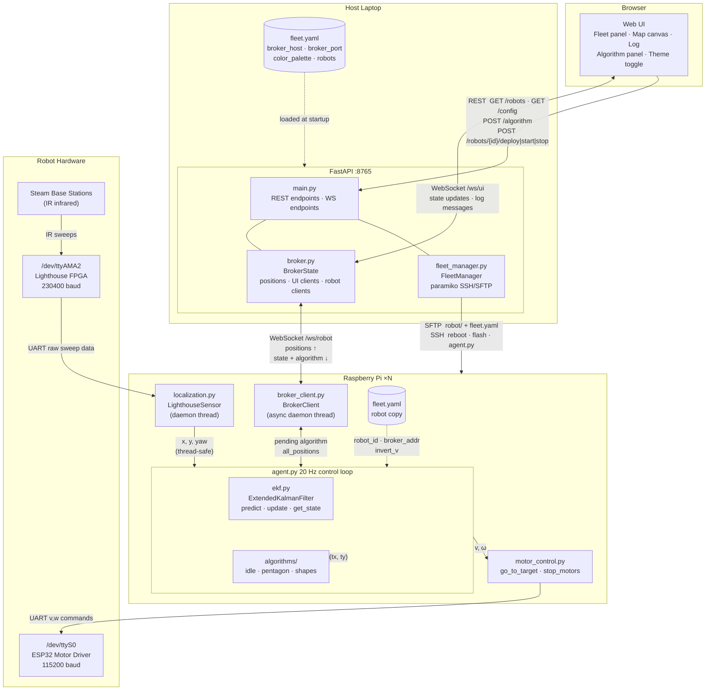

# botsim-v2 — Swarm Robotics Platform Plan

## Overview

A web-based platform for orchestrating a fleet of differential-drive robots (Raspberry Pi + ESP32) using Steam Lighthouse-based localization. The host computer deploys code, starts/stops robots, and selects swarm algorithms. Algorithms run **on each Pi**; the host acts as a position broker and fleet manager.

---

## Hardware Context

- **Robot**: Differential drive, Raspberry Pi + ESP32 (motor driver via UART)
- **Localization**: Steam Lighthouse deck (infrared), connected to Pi via `/dev/ttyAMA2`
- **Fleet size**: 5–6 robots
- **Hostnames**: `visor@civr-1.local`, `visor@civr-2.local`, etc. (configurable)
- **Network**: All devices on the same WiFi; host connects to Pis via mDNS/SSH

---

## Architecture



### Host responsibilities (runtime)
1. Receive position updates from all Pis → maintain global state
2. Broadcast global state back to all Pis (so each robot knows all positions)
3. Push algorithm selection commands to all Pis
4. SSH-based deploy, start, stop
5. Serve the web UI

### Pi responsibilities (runtime)
1. Localize via lighthouse, publish `{id, x, y, theta}` to host broker
2. Receive `{all_positions}` + `{algorithm: "pentagon"}` from host broker
3. Run the selected algorithm locally: `algorithm.compute_target(my_id, all_positions)` → `(tx, ty)`
4. Execute motor control toward that target

---

## Repository Structure

```
botsim-v2/
├── PLAN.md
├── TODO.md
├── fleet.yaml                    # Robot fleet configuration
├── requirements-host.txt         # Host Python dependencies
├── requirements-robot.txt        # Pi Python dependencies (deployed with robot/)
│
├── host/                         # Runs on the host laptop
│   ├── main.py                   # FastAPI app: web UI server + broker endpoints
│   ├── fleet_manager.py          # SSH: deploy, start, stop per robot
│   └── broker.py                 # WebSocket broker: aggregates positions, fans out state
│
├── web/                          # Browser UI (served by FastAPI)
│   ├── index.html
│   ├── app.js
│   └── style.css
│
└── robot/                        # Deployed to each Pi via rsync/SCP
    ├── agent.py                  # Main entry point; fixed-rate 20 Hz control loop
    ├── localization.py           # LighthouseSensor class (threaded); runs sensor in background
    ├── ekf.py                    # ExtendedKalmanFilter: fuses lighthouse + kinematic prediction
    ├── motor_control.py          # go_to_position, pure_pursuit, serial setup (/dev/ttyS0)
    ├── broker_client.py          # WebSocket client: publish position, receive state
    ├── config.py                 # Reads robot ID and broker address from config file
    └── algorithms/
        ├── base.py               # Abstract base class: compute_target(my_id, all_positions)
        ├── idle.py               # Default: stop motors, hold position
        └── pentagon.py           # Pentagon formation with nearest-vertex assignment
```

---

## Key Design Decisions

### Broker connection timeout
- Each Pi keeps a `last_contact` timestamp
- If the broker is unreachable, the robot continues toward its last known target
- If disconnected for more than `broker_timeout` seconds (default: 5, set in `fleet.yaml`), the robot switches to `idle` (stops motors)
- The Pi reconnects automatically in the background

### Algorithm startup state
- On startup, robots always begin in `idle` (stopped) regardless of what was running before
- The host UI sends an explicit algorithm selection to start movement

### Vertex/target assignment in algorithms
- Algorithms compute all targets (e.g., pentagon vertices) from the centroid of current robot positions
- Assignment uses minimum total distance (scipy `linear_sum_assignment`)
- Each robot independently computes the same assignment deterministically and selects its own target by `my_id`
- No inter-robot communication required beyond what the broker already provides

### Serial ports on the Pi
- **`/dev/ttyAMA2`** — lighthouse FPGA UART (raw sensor data in, 230400 baud)
- **`/dev/ttyS0`** — ESP32 motor driver UART (velocity commands out, 115200 baud)
These are two distinct ports and must not be confused.

### Bootloader / lighthouse FPGA init
- `deck.sh` runs the full sequence on every `Start`:
  1. Reboot lighthouse FPGA via `reboot.py`
  2. Flash `lighthouse.bin` via `uart_bootloader.py`
  3. Launch `agent.py`
- This is safe to run every session start; takes a few extra seconds
- `Stop` from the UI kills only the `agent.py` process (FPGA stays loaded)
- A future "Restart Agent" action (no bootloader re-flash) can be added when needed

### SSH authentication
- Initially supports password-based SSH (password stored in local `.env`, gitignored)
- Recommend setting up key-based auth for all Pis as a one-time setup step (instructions in README)
- `fleet_manager.py` uses `asyncssh` which supports both modes

---

## Fleet Configuration (`fleet.yaml`)

```yaml
broker_host: "192.168.x.x"    # Host laptop IP — set before deploying
broker_port: 8765
broker_timeout: 5              # Seconds before robot stops if broker unreachable
trajectory_cleanup_delay: 3   # Seconds after arrival before trail is cleared from UI map

color_palette:                 # Named colors available for robot assignment
  red:    "#e74c3c"
  blue:   "#3498db"
  green:  "#2ecc71"
  yellow: "#f1c40f"
  white:  "#aaaaaa"            # Grey substitute (pure white is invisible on light backgrounds)

robots:
  - id: civr-white
    host: civr-white.local
    user: visor
    color: white               # References color_palette key
  - id: civr-blue
    host: civr-blue.local
    user: visor
    color: blue
  # ... color is optional — UI auto-assigns from palette in definition order if omitted
```

---

## Component Details

### `robot/localization.py`
Wraps all lighthouse decoding in a `LighthouseSensor` class that runs in a background thread:
- Low-level classes: `SweepData`, `SweepBlock`, `Angles`, `BaseStation`, `PulseProcessor`
- Helper functions: `calculateAE()`, `ts_sub()`, `ts_add()`, `PERIODS`, `get_yaw_from_rvec()`
- `LighthouseSensor(source_path)` — accepts `/dev/ttyAMA2` or a `.bin` file
  - `run_continuous_reading()` — blocking loop, meant to run in a `daemon=True` thread
  - `check_new_data()` → `bool`
  - `get_latest_reading()` → `(x, y, yaw)` — thread-safe via `threading.Lock`
- Note: PnP output maps `tvec[0]` → X, `tvec[2]` → Y (camera Z-axis = robot forward)

### `robot/ekf.py`
`ExtendedKalmanFilter` that fuses lighthouse measurements with differential-drive kinematics:
- State vector: `[x, y, yaw]`
- `predict(v, w, dt)` — kinematic model step; updates covariance via Jacobian `F`
- `update(meas_x, meas_y, meas_yaw)` — lighthouse correction; identity `H` matrix
- `get_state()` → `(x, y, yaw)`
- Tunable: process noise `Q`, measurement noise `R` (lighthouse is very accurate → small `R`)

### `robot/motor_control.py`
- Serial setup (`/dev/ttyS0`, 115200 baud — **motors only; lighthouse UART is `/dev/ttyAMA2`**)
- `go_to_position(x, y, theta)` → `(v, w)` — proportional heading + distance control
- `pure_pursuit(x, y, theta)` → `(v, w)` — lookahead-based path follower along `TARGET_LIST`; smoother for multi-waypoint navigation
- `stop_motors()` — sends `0.00,0.00\n`
- Gains (`Kv`, `Kh`) and safety caps (`MAX_V`, `MAX_W`, `STOP_DIST`) as module-level constants

### `robot/broker_client.py`
- Async WebSocket client
- Sends: `{"type": "position", "id": "civr-1", "x": 1.2, "y": 0.5, "theta": 0.3}`
- Receives:
  - `{"type": "state", "positions": {"civr-1": {...}, "civr-2": {...}}}` — global robot state
  - `{"type": "algorithm", "name": "pentagon"}` — algorithm switch
- Tracks `last_contact` timestamp; signals timeout to agent

### `robot/agent.py`
Fixed-rate 20 Hz control loop (sensor runs in a separate background thread):
```
load config (robot ID, broker address)

sensor = LighthouseSensor("/dev/ttyAMA2")
start sensor.run_continuous_reading() in daemon thread

start broker_client in background thread

ekf = ExtendedKalmanFilter()
current_algorithm = idle
current_v, current_w = 0, 0

loop at 20 Hz (DT = 0.05 s):
    ekf.predict(current_v, current_w, DT)

    if sensor.check_new_data():
        x, y, yaw = sensor.get_latest_reading()
        ekf.update(x, y, yaw)
        broker_client.publish_position(x, y, yaw)

    est_x, est_y, est_yaw = ekf.get_state()

    if broker_client.timed_out():
        stop_motors()
        current_v, current_w = 0, 0
        continue

    if broker_client.has_new_algorithm():
        current_algorithm = load_algorithm(new_name)

    all_positions = broker_client.get_latest_state()
    target = current_algorithm.compute_target(my_id, all_positions)
    if target is None:
        current_v, current_w = 0, 0
        stop_motors()
    else:
        current_v, current_w = pure_pursuit(est_x, est_y, est_yaw)
        send motor command (current_v, current_w)

    sleep(remaining time to fill DT)
```

### `robot/algorithms/base.py`
```python
class SwarmAlgorithm:
    def compute_target(self, my_id: str, all_positions: dict) -> tuple[float, float]:
        raise NotImplementedError
```

### `robot/algorithms/pentagon.py`
1. Compute centroid of all known robot positions
2. Place 5 pentagon vertices evenly around centroid at a fixed radius
3. Use `scipy.optimize.linear_sum_assignment` to assign robots → vertices (min total distance)
4. Return the vertex assigned to `my_id`

### `host/broker.py`
- Manages all active Pi WebSocket connections
- On position message from Pi: update global `positions` dict, broadcast updated state to all Pis and to UI clients
- On algorithm command from UI: broadcast `{"type": "algorithm", "name": "..."}` to all Pis

### `host/fleet_manager.py`
- Uses `paramiko` (same approach as shape-deployer) wrapped in `asyncio.run_in_executor`
- `deploy(robot_id)` — SFTP upload `robot/` + `fleet.yaml` to `~/botsim/` on Pi (SCP; rsync not available)
- `start(robot_id)` — SSH: inline lighthouse flash (reboot → bootloader → bin), then launch `agent.py` as background daemon (replaces `deck.sh`)
- `stop(robot_id)` — SSH: `pkill -f agent.py`
- `deploy_all()`, `start_all()`, `stop_all()` — parallel across fleet via `asyncio.gather`
- SSH password from `SSH_PASSWORD` env var (`.env` file, gitignored)

### `host/main.py` — FastAPI endpoints
| Method | Path | Description |
|---|---|---|
| GET | `/robots` | Fleet status (online/offline, last position) |
| POST | `/robots/{id}/deploy` | Deploy `robot/` to one robot |
| POST | `/robots/{id}/start` | Full start (bootloader + agent) |
| POST | `/robots/{id}/stop` | Stop agent process |
| POST | `/robots/deploy_all` | Deploy to all robots |
| POST | `/robots/start_all` | Start all robots |
| POST | `/robots/stop_all` | Stop all robots |
| POST | `/algorithm` | Switch algorithm: `{"name": "pentagon"}` |
| WS | `/ws/robot` | Pi agents connect here |
| WS | `/ws/ui` | Browser connects here for live updates |

### `web/` — UI panels
- **Fleet panel**: one row per robot — hostname, online/offline badge, last seen position, per-robot deploy/start/stop buttons; group action buttons (Deploy All, Start All, Stop All)
- **Algorithm panel**: dropdown of available algorithms, Run button
- **Log panel**: streaming status/output from fleet manager and broker
- **Map panel**: 2D canvas showing live robot positions (dots with heading lines), historical trajectory trails, and formation target crosses; each robot rendered in its configured color; updated on each `/ws/ui` position message
  - Robot dot and heading line: robot's color
  - Historical trail: lighter/semi-transparent variant of robot's color; accumulates past positions client-side
  - Target cross (×): darker variant of robot's color; drawn at the robot's assigned formation vertex
  - Trail cleared when robot has reached target **and** `trajectory_cleanup_delay` seconds have elapsed (whichever is later)

---

## Implementation Phases

| Phase | Work |
|---|---|
| **1** | Refactor reference files → `localization.py` (LighthouseSensor class) + `ekf.py` + `motor_control.py` (pure_pursuit) + `agent.py` (fixed-rate 20 Hz loop); update `deck.sh` to call `agent.py` |
| **2** | Add `broker_client.py` with timeout logic; add `algorithms/` (`idle`, `pentagon`); full robot-side stack |
| **3** | Build `host/broker.py` + `host/fleet_manager.py` + `host/main.py` (FastAPI backend) |
| **4** | Build `web/` UI (fleet panel, algorithm panel, log panel, 2D live map canvas) |
| **5** | Additional algorithms (foraging, etc.) as needed |
| **6** | Collision avoidance: repulsion-based velocity modification on-Pi |

---

## Future / Out of Scope for Now
- Direct keyboard teleoperation of a single robot from host
- Per-robot gain tuning from UI
- Monitoring / metrics dashboard
- Collision avoidance (planned for Phase 7)
